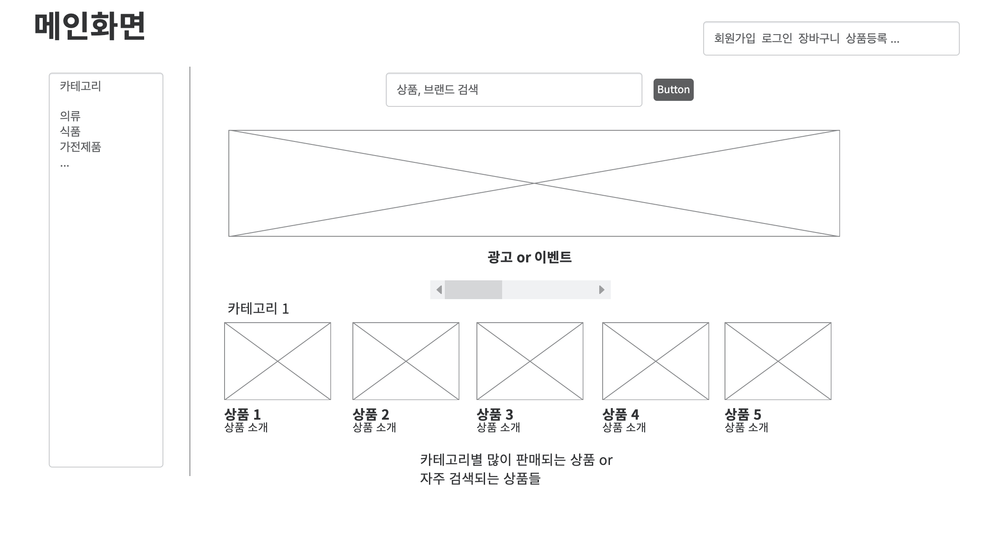
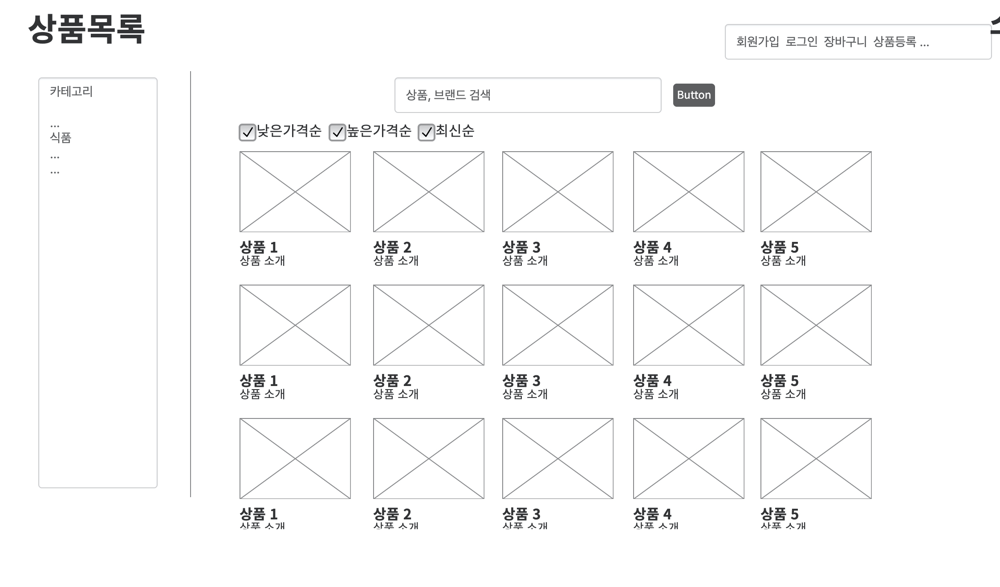
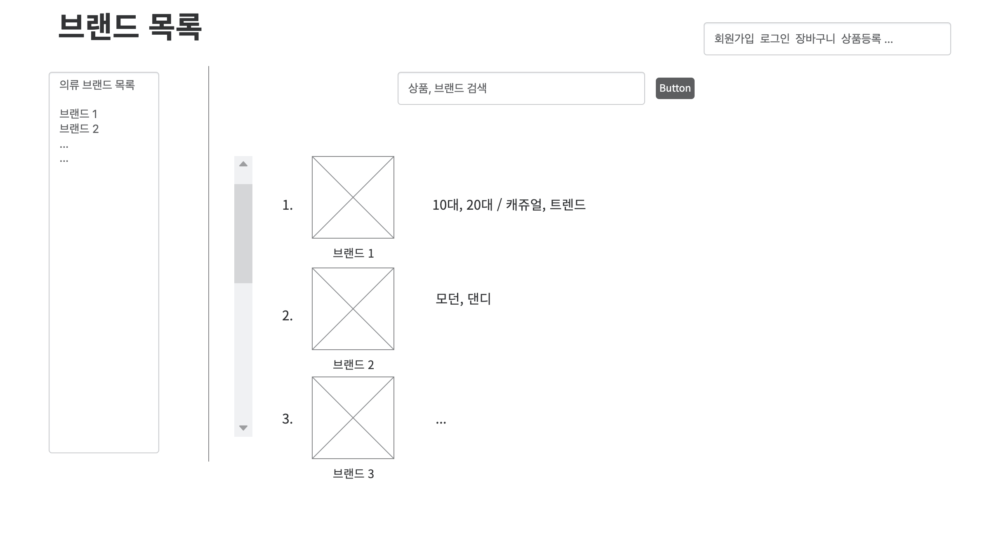

## Open Market Project

 이 프로젝트는 오픈마켓을 구현한 프로젝트입니다. 서버 개발에 더 집중하기위해 카카오 오븐을 통해 프로토타입을 만들어 프론트엔드를 대신하였습니다. ‘누가 / 무엇을 위해 / 어떤 것이 필요하다’ 라는 3단계의 과정을 통해 유즈케이스를 정의하여 개발해야 할 기능들을 도출하였습니다.

 효율적인 프로젝트관리를 위해 개발해야 할 기능들을 깃헙의 이슈로 발행하였고 이슈 단위로 브랜치를 만들어서 개발하였습니다. 이후 검증이 끝난 커밋만을 코드만을 결합하여 프로젝트를 관리하였습니다.  
 
 개발하면서 고민했던 내용들을 블로그에 정리하였고, 프로토타입, 유즈케이스와 같이 [깃헙 위키](https://github.com/jjeda/Open-Market/wiki)를 통해 관리하였습니다.  

보다 디테일한 내용은 [이곳](details.md)을 참고해주세요.

## 기능
#### 고객
- 상품조회, 구매
- 장바구니
- 회원정보 수정, 회원 탈퇴
#### 판매자
- 상품 등록,수정,삭제
#### 관리자
- 회원관리
- 광고비에 따른 상품노출 
#### 자주보여주는 데이터 캐싱
- 메인화에 보여주는 데이터
- 핫딜 상품 데이터  
#### CI/CD

## [프로토타입](https://ovenapp.io/view/LAt0douDc5vAO0jdQXuMH9VnFPB9Kmmn/OxtPf)

 
## [기술적인 문제 해결 과정](https://github.com/jjeda/Open-Market/wiki/%EC%96%B4%EB%96%BB%EA%B2%8C-%ED%95%B4%EA%B2%B0%ED%95%98%EC%98%80%EC%9D%84%EA%B9%8C%3F)
#### 회원 데이터에 대한 접근 분리 (회원/관리자)
- 회원 정보를 같은 컨트롤러에서 처리 시 회원이 엔드포인트에 접근하는 경우 발생
- 복잡해지는 인가 로직 -> 컨트롤러 분리
- 회원은 회원 id(PK)값으로 접근하는 것이 아닌 Session 에서 현재 사용자를 불러와 접근
- Adapter 패턴을 이용하여 Account 객체를 스프링 시큐리티가 알고있는 UserDetails로 구현
- User(UserDetails 구현체)를 통해 DB에서 Account를 불러오는 과정을 생략 할 수있음 -> DB에 대한 부하를 줄일 수 있었다 
- 관련 포스팅 : [@AuthenticationPrincipal - 현재 사용자 조회하기](https://jjeda.tistory.com/7) 
#### 결제서비스 추상화
- 무통장 결제, 카드 결제, 모바일 결제 와 같이 비슷한 성격의 서비스를 일관적인 방법으로 사용하기위한 추상화적용
- 관련 포스팅 : [어떻게 성격이 비슷한 여러 종류의 서비스를 추상화할까? - 전략 패턴을 통한 추상화](https://jjeda.tistory.com/8)
#### 공유객체에 대한 동시성 문제
- Redis 는 데이터를 싱글스레드 기반으로 처리함
- 쓰레드간의 동기화이슈는 발생하지 않지만,
- 여러 트랜잭션에서 하나의 객체에 접근하는 경우는 발생
- [Redis Transactions](https://redis.io/topics/transactions) 를 통해해결
- 관련 포스팅1 : [Why Redis? (Redis vs Memcached)](https://jjeda.tistory.com/10)
- 관련 포스팅2 : [Redis의 동시성(Concurrency)개념과 고립성(Isolation)을 위한 Transaction 처리](https://jjeda.tistory.com/13) 

## UML Diagram

## USECASE [(Prototype)](https://ovenapp.io/view/LAt0douDc5vAO0jdQXuMH9VnFPB9Kmmn/OxtPf)
- 고객
  - 고객은 상품조회 및 상품구매를 위해 회원가입, 회원수정, 회원탈퇴를 할 수 있다.
  - 고객은 어떤 상품을 구매할지 보기 위해 (랭킹, 가격, 등록) 등의 옵션으로 상품목록를 카테고리별로 볼 수 있다.
  - 고객은 카테고리별로 브랜드 비교를 위해 브랜드 목록을 볼 수 있다.
    - 신발 카테고리 : 나이키, 반스, 아디다스  
  - 고객은 원하는 특정 물건을 구매하기 위해 검색을 통해 물건을 판매하는 판매자의 목록을 불러올 수 있다.
  - 고객은 최종 구매 전 상품비교 등을 목적으로 장바구니를 통해 원하는 상품을 구매 전에 확인 할 수 있다.
- 판매자
  - 판매자는 상품 판매를 위해 물건을 등록, 수정, 삭제 할 수 있다.
  - 판매자는 상품 판매를 촉구하기 위해 물건에 대한 광고 및 이벤트를 진행 할 수 있다.
- 관리자
  - 관리자는 회원관리를 위해 고객/판매자의 상태를 관리 할 수있다.
    - BAN, NORMAL
